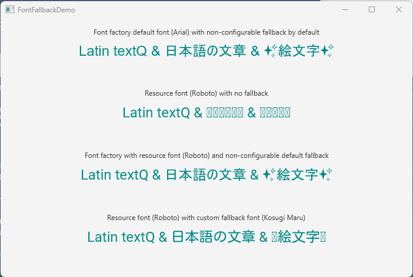

# javafx-custom-font-fallback-demo
A demo project illustrating how to define a custom fallback font for JavaFX (JavaFX 21)

# Requirements
Java ≧21 and Maven ≧3.9

# Build
Build with `mvn clean javafx:jlink` and run with `mvn javafx:run`

